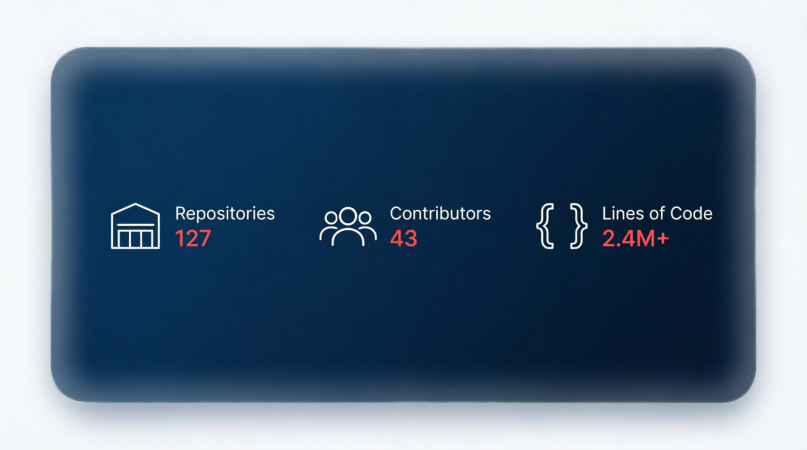
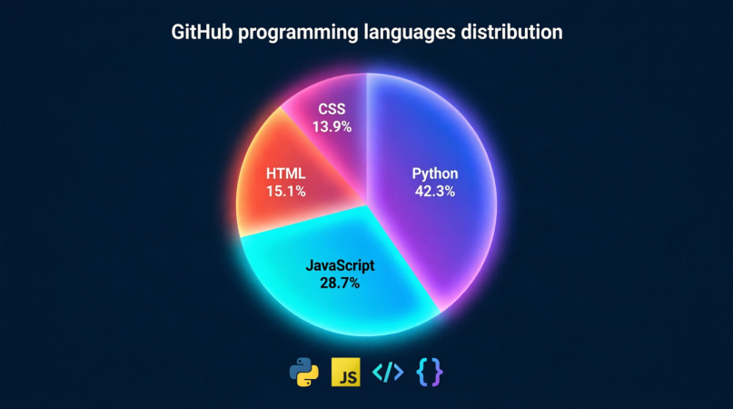
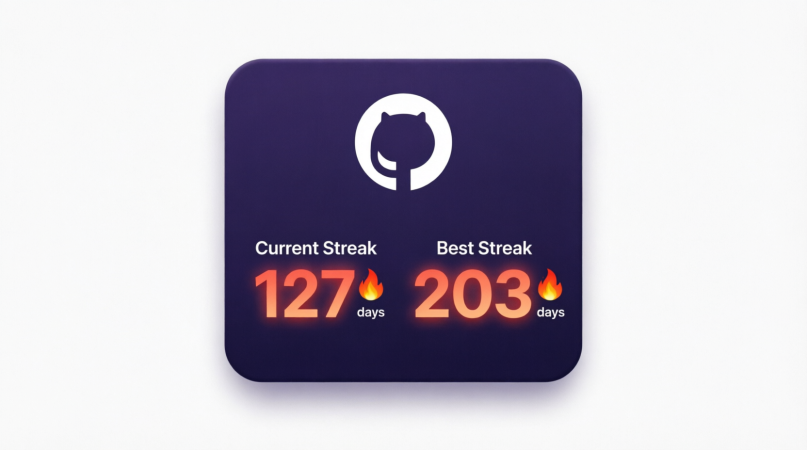

# 👨‍💻 [Mengliyev Bexruzbek]

### 🎯 Software Developer | 💻 Tech Enthusiast | 🚀 Backend developer

---

  

---

## 📌 About Me
My name is Bexruzbek.I'm 15 years old.I'm from Uzbekistan.I will be backend developer in the future.I'm studing Al-xrazmiy vorislari now.And  alot of jobs after me.

## 🛠️ Technologies & Tools

  
  
  
  
  
  

---

## 📊 My GitHub Stats

### 📈 Profile Overview

  

### 💻 Most Used Languages

  
  

---

## 🔥 GitHub Contribution Graph

  

---

## 📫 Connect With Me

  
  
  
  

---

### 🏆 Profile Views

  

---

  <strong>⌨️ Made with Passion | 🌟 Keep Coding 🚀</strong>

